# Clavert Keyboard

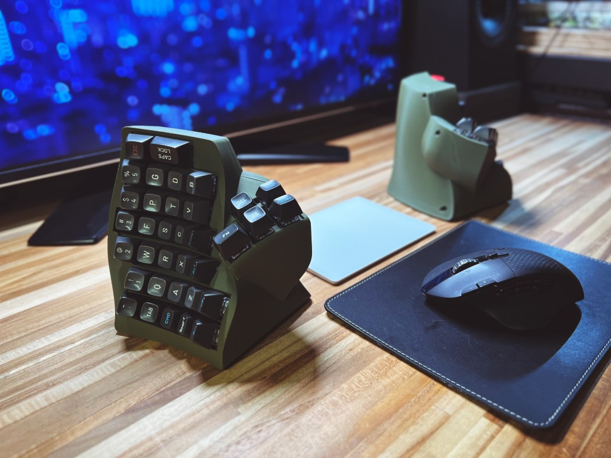

Clavier, vertical.

It's a (pair of?) ZMK powered wireless ergonomic split keyboard.

## Suggested Materials

Below are some of the more important materials for the build. Misc materials not listed.

- MX compatible switches * 70
- Kailh hotswap sockets * 70
- 1N4148 diodes * 70
- EVQWGD001 encoder * 1
- 18650 battery * 2
- nice!nano v2 * 2
- M3*4 heat set inserts * 16
- M3*6 flat head hex screw * 16 (or philips, I used hex because I have them lying around)

This board only uses 1u keycaps because
1. It's really hard to find keycap sets that come with enough 1.5u or 1.25u keys.
2. Thanks to the rise of popularity of ortholinear keyboards it's relatively easy to find good ortho sets and they usually comes with many extra/novelty caps.
3. Your milage may vary but I personally don't think >1u modifiers are necessary.

## Printing the case

Download the STL files from `stl` directory.

The case consists of two halves and a battery holder. They should be printed with the 'inside' facing build plate and with supports. 

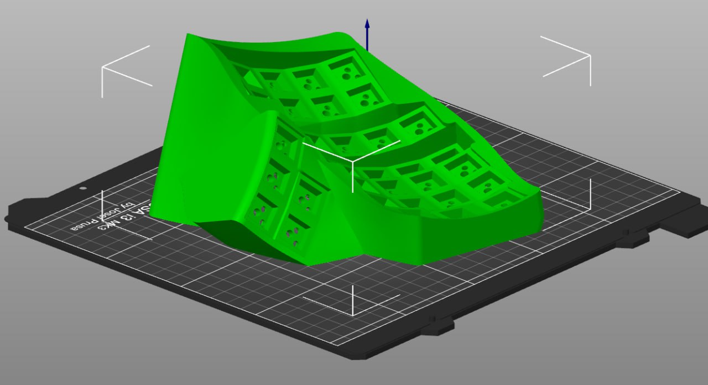

Currently there's no cutout for physical reset buttons and power switches because ZMK supports sending reset/bootloader signal with key press. The left side face half comes in two versions, with or without encoder. Only left side because as of writing of this readme ZMK only supports encoders on the central side. The halves and battery holders are assembled with heat set inserts and screws.

**DO NOT** mirror face half and print them because you will mirror the hotswap socket holes too. The back halves are fine.

#### Print setting suggestions

There are a lot of steep overhangs in the lower layers due to the print orientation. If your slicer supports it, it's better to print outer walls first to prevent warping which might result in small details in lower layers getting knocked off.  ("External pemimeters first" for Slic3r and forks and "Wall Ordering -> Outside to Inside" for Cura)

It's best to put supprot inhibitors to the outside of the case or dial down the overhang threshold since these slopes should be printed fine without supports.

## Wiring

I don't know how to design a PCB so this is a hand wired build(lame I know). It's basically a Redox layout with an encoder. Diagram for left hand side below. 

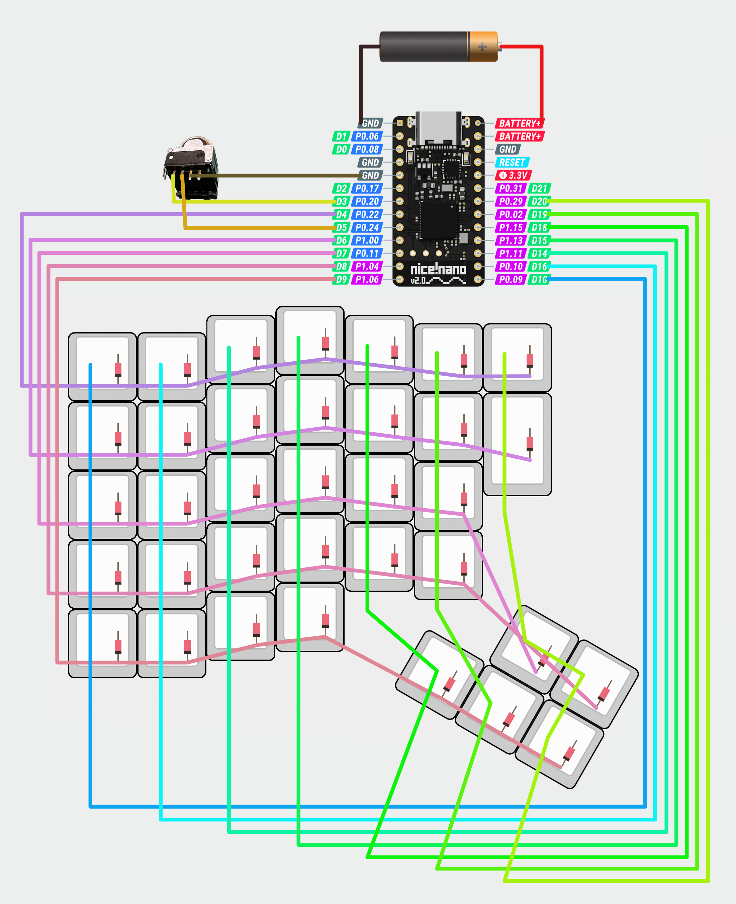

For right hand simply mirror the columns(i.e. wire leftmost column to 20 instead of 10) and ignore the encoder. You can wire a physical reset button to GND and RESET for easy flashing/resetting. 

## Customizing

You might want to make your own keymap instead of using mine(which I guess only make sense to me). You can fork this repository and edit the .keymap file. ZMK utilize Github actions to compile firmwares so upon commit Github will automatically create firmware files with your keymap. You can find it in the actions tab to your repo -> `https://github.com/$your_username/$your_repo_name/actions`

To flash nice!nanos you need only to double click reset(or quickly bridge GND and RESET twice) and it will show up as a flash drive. You can then drop the `.uf2` files that you grabbed from Github to it and it's done.

Please refer to official ZMK documentations for more info.

https://zmk.dev/docs/user-setup

https://zmk.dev/docs/customization

## Credits

- Obviously, the layout and schematics are from [Redox keyboard](https://github.com/mattdibi/redox-keyboard)
- The design is inspired by and derived from [Redox Manuform by Fosk_LL](https://www.thingiverse.com/thing:3503380)
- The 18650 battery holder is modefied from [this design by YXC](https://www.thingiverse.com/thing:2847497)

## Gallery

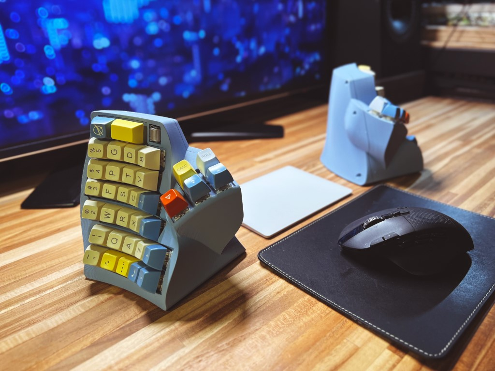
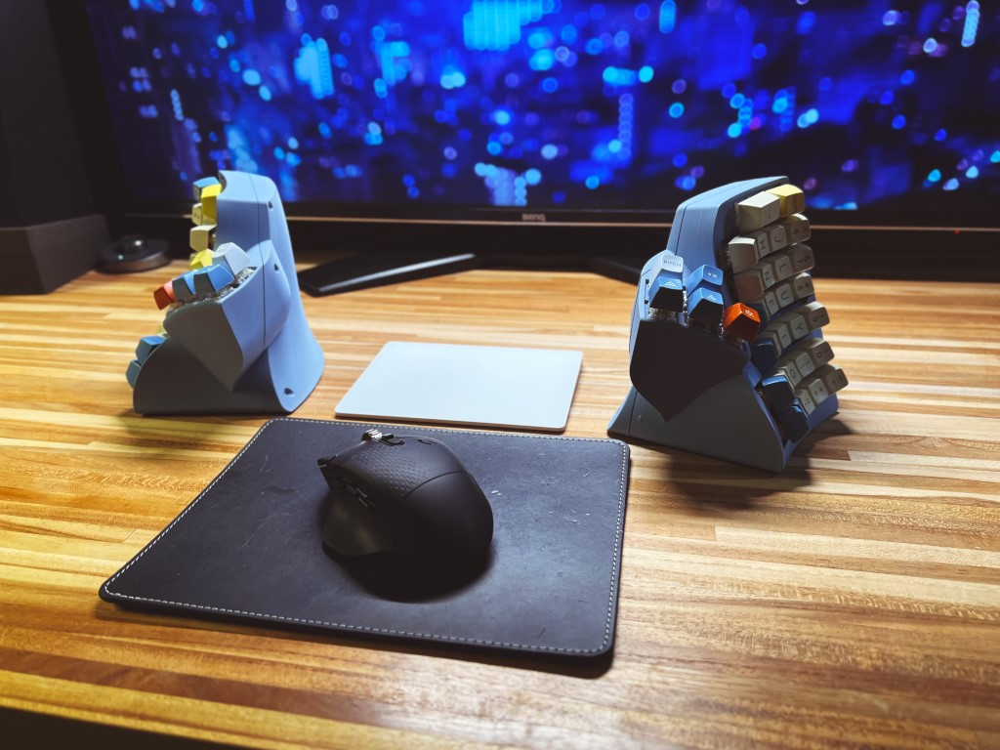
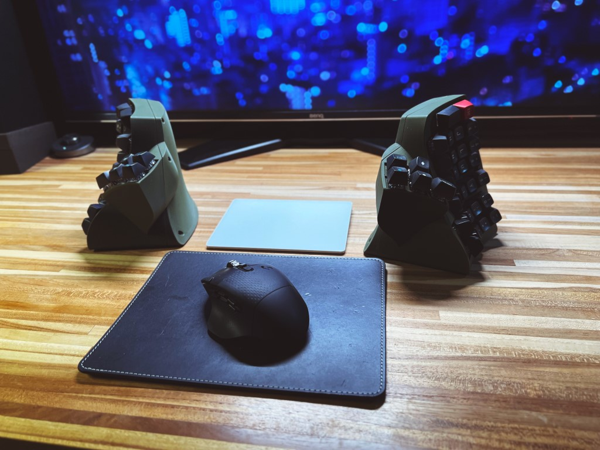
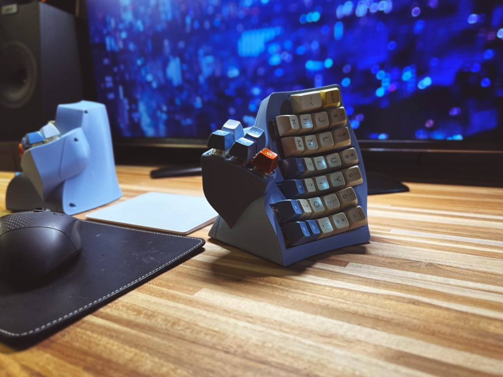
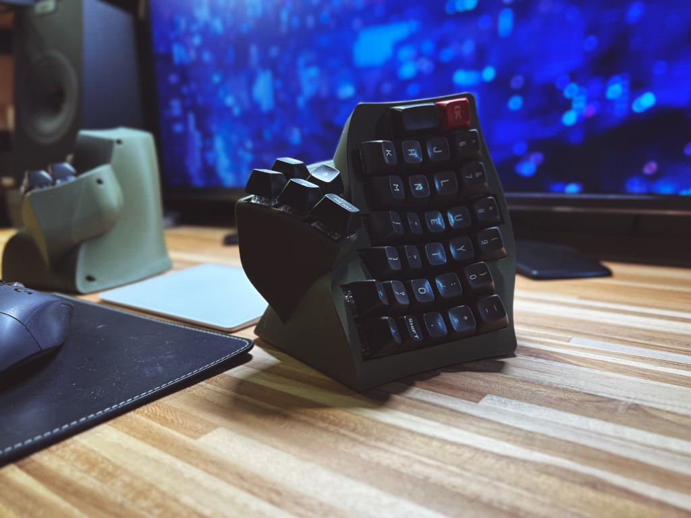
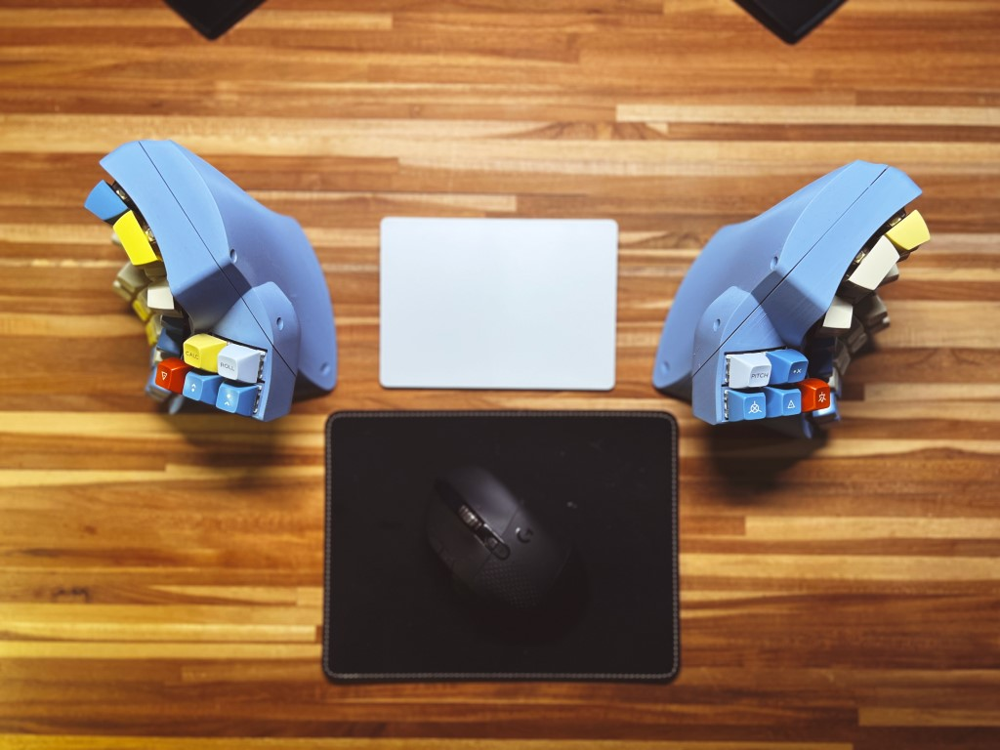
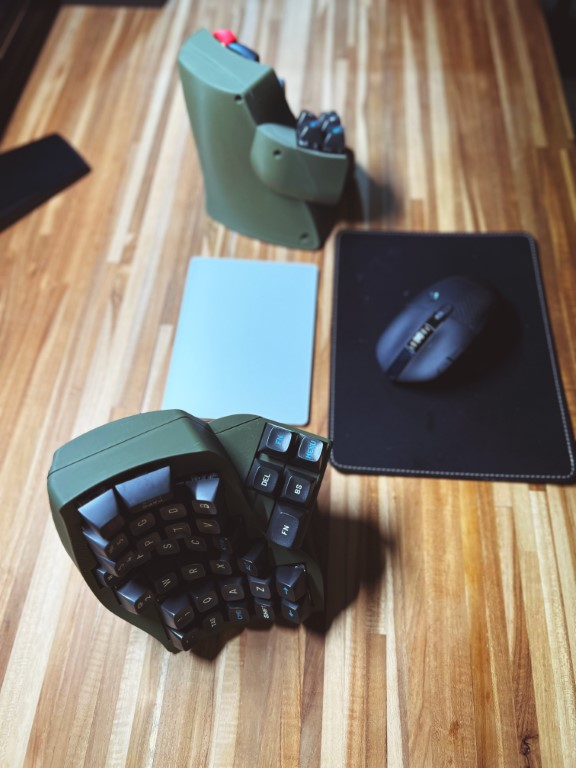
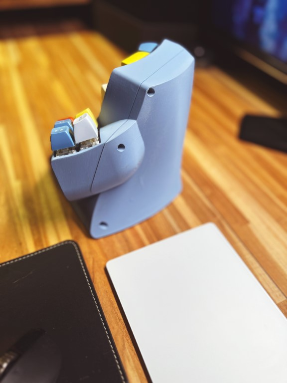
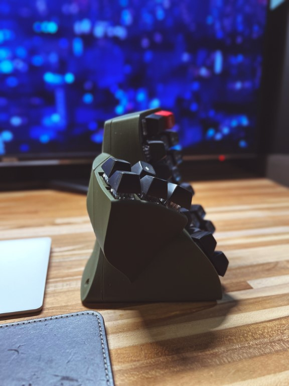
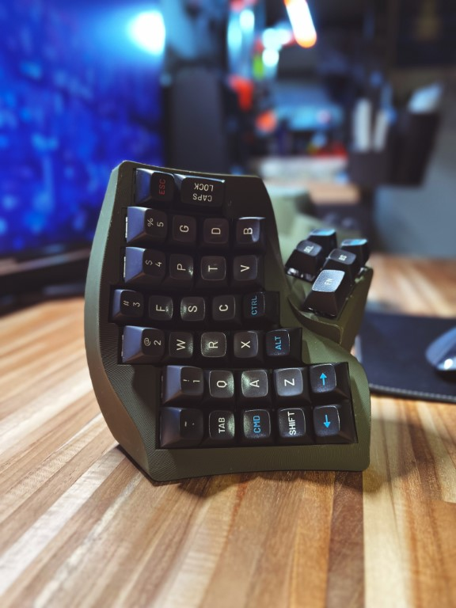

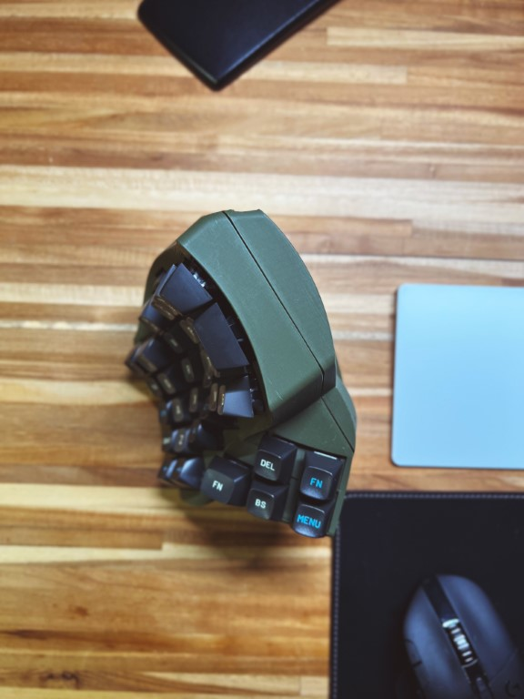